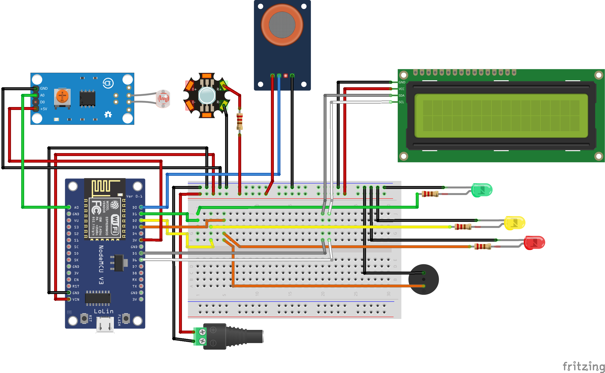

# 🥚 IoT Monitoring Kualitas Telur

Sistem monitoring kualitas telur berbasis **ESP8266** dan **Firebase** yang membaca kondisi lingkungan penyimpanan telur secara real-time dan menampilkan status kesegaran ke dashboard.

<!-- EDIT: ganti dengan screenshot dashboard/alat kamu. Taruh gambar di folder /assets lalu update path di bawah -->


---

## 📌 Latar Belakang

<!-- EDIT: jelaskan masalah nyata yang mendasari project ini, misal kerugian akibat telur busuk yang tidak terdeteksi dini, kesulitan memantau kualitas telur secara manual, dsb -->
Telur yang disimpan dalam waktu lama rentan mengalami penurunan kualitas akibat perubahan suhu, kelembapan, dan produksi gas (amonia/H2S) dari proses pembusukan. Project ini dibuat untuk memantau kondisi tersebut secara otomatis dan real-time, sehingga potensi kerusakan dapat terdeteksi lebih awal.

## ✨ Fitur

- Monitoring suhu dan kelembapan ruang penyimpanan secara real-time
- Deteksi gas hasil pembusukan menggunakan sensor gas (MQ-series)
- Deteksi cahaya/intensitas menggunakan sensor LDR
- Notifikasi/indikator visual (LED) sesuai tingkat kesegaran telur
- Data dikirim dan disimpan ke **Firebase Realtime Database**
- Tampilan status pada **LCD I2C 16x2**

## 🛠️ Teknologi & Komponen

| Kategori | Detail |
|---|---|
| Mikrokontroler | NodeMCU ESP8266 |
| Sensor | Sensor gas (MQ-series), LDR, sensor suhu |
| Output | LCD I2C 16x2, LED indikator, buzzer |
| Backend | Firebase Realtime Database |
| Bahasa | C++ (Arduino Framework) |

## 🔌 Skema Rangkaian

<!-- EDIT: gambar fiks.png kamu cocok ditaruh di sini -->


## 🚀 Cara Menjalankan

1. Clone repository ini
   ```bash
   git clone https://github.com/USERNAME-KAMU/NAMA-REPO.git
   ```
2. Buka project menggunakan **Arduino IDE** atau **PlatformIO**
3. Install library yang dibutuhkan:
   - `ESP8266WiFi`
   - `Firebase ESP8266 Client`
   - `LiquidCrystal_I2C`
4. Sesuaikan kredensial WiFi dan Firebase di file konfigurasi:
   ```cpp
   #define WIFI_SSID "nama_wifi_kamu"
   #define WIFI_PASSWORD "password_wifi_kamu"
   #define FIREBASE_HOST "xxxx.firebaseio.com"
   #define FIREBASE_AUTH "xxxx"
   ```
5. Upload program ke board NodeMCU ESP8266
6. Rangkai komponen sesuai skema di atas

## 📊 Hasil / Dampak

<!-- EDIT: isi dengan hasil nyata, misalnya akurasi pembacaan sensor, waktu deteksi dini, atau feedback dari uji coba -->
- Sistem berhasil mendeteksi perubahan kadar gas pembusukan sejak dini
- Data dapat dipantau dari jarak jauh melalui Firebase

## 📄 Lisensi

Project ini dibuat untuk keperluan pembelajaran/tugas akhir.

---

**Dibuat oleh:** Rehan Wahyu Andika
📧 rehannn.wahyuandika@gmail.com
